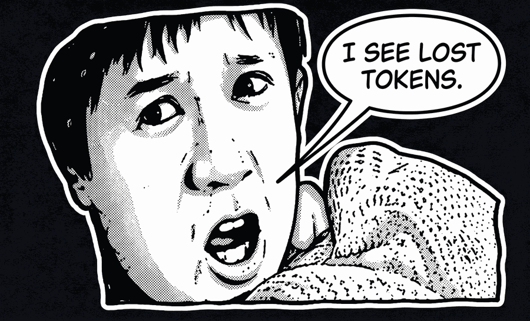

<p align="center">
  
</p>

<h1 align="center">Sixth Sense</h1>

<p align="center">
  <em>He sees them before you write them: bad diagnoses, bloated builds, skipped review.</em>
</p>

<p align="center">
  
  
  
  
  
</p>

<p align="center">
  Catches bugs before they ship, and blocked features before they're built: per-task model/effort routing, stack-aware TDD (Java, Angular, React/Next.js, Python), and a two-pass adversarial reviewer (Dylan Dog). A fork of <a href="https://github.com/obra/superpowers">obra/superpowers</a>.<br>
  Some conventions adapted from <a href="https://github.com/mattpocock/skills">mattpocock/skills</a> and <a href="https://github.com/DietrichGebert/ponytail">DietrichGebert/ponytail</a> (see Credits).
</p>

<p align="center">
  <sub>Created by <a href="https://github.com/dariovr1">Dario Amato</a></sub>
</p>

---

## At a Glance

Sixth Sense starts from Superpowers' TDD foundation and stacks four things on top of it:

```
┌───────────────────────────────────────────────────┐
│ Dylan Dog: adversarial review, two-pass            │  Sixth Sense adds this
├───────────────────────────────────────────────────┤
│ grilling + Premortem: design stress-test           │  Sixth Sense adds this
├───────────────────────────────────────────────────┤
│ 8 model/effort tiers, routed per task              │  Sixth Sense adds this
├───────────────────────────────────────────────────┤
│ crossroad-stack: Java / Angular / React / Py       │  Sixth Sense adds this
├───────────────────────────────────────────────────┤
│ red-green-refactor TDD + verification gates        │  Superpowers has this
│ (this part is Superpowers)                         │
└───────────────────────────────────────────────────┘
```

If you don't read past this diagram: Superpowers gives every task the same model and one review pass. Sixth Sense picks the model per task, matches the review depth to the risk, and speaks four different stack conventions instead of one generic set of rules. The full breakdown is in [Sixth Sense vs. Superpowers](#sixth-sense-vs-superpowers) below.

## Goal

Reduce Superpowers' static footprint and reasoning overhead without losing the discipline that makes it reliable, while adding explicit model and effort control for every subagent.

### 1. Startup footprint: -44%

Counting only what always loads (each plugin's `SKILL.md` files; Sixth Sense also counts its 8 `agents/*.md` tier definitions, since that routing logic lives there instead of inside `SKILL.md`):
- Superpowers: about 125KB (about 31,300 tokens at 4 bytes/token)
- Sixth Sense: about 70KB (about 17,600 tokens)
- Result: Sixth Sense loads 44% less text at startup.

Measured directly from both repositories on 2026-07-17 (`wc -c` here, the GitHub API for `obra/superpowers`). This is a static file-size comparison, not a runtime or cost benchmark: it doesn't account for progressive disclosure (only a triggered skill's full body loads).

### 2. Savings for equivalent coverage (apples-to-apples): -23%

Sixth Sense includes capabilities Superpowers doesn't have (per-stack routing, model/effort control, Dylan Dog). Running `node scripts/benchmark.js` yourself (data as of 2026-07-21), which nets out those extra capabilities and compares only the skills that do the same job:
- Real net savings: 23%.

Both this number and the 44% above are real and measured, not guessed — they just answer different questions. Read 44% as total footprint, 23% as apples-to-apples cost for comparable coverage.

### 3. Result of a real test on a concrete task (Python bugfix)

A real task run through both frameworks: a Python module with no tests and a bug in a discount calculation (a discount over 100% produces a negative price).

**Skill activation:**
- Diagnosis: Superpowers triggers `systematic-debugging`; Sixth Sense triggers `diagnosing-bugs`.
- Stack analysis: Superpowers has no dedicated router; Sixth Sense triggers `crossroad-stack` (detects Python, applies the language's conventions).
- Review: Superpowers triggers `requesting-code-review` (generic); Sixth Sense triggers `dylan-dog` in Hunting mode.

**Process difference:**
- Superpowers: fixes the reported bug, commits, and only discovers a second bug (a negative discount raising the price) during code review, after the fact.
- Sixth Sense: the TDD skill requires mapping every edge case upfront, catching and fixing both bugs before the commit.

**Token usage on this task:** Superpowers ~8,127 tokens; Sixth Sense ~7,743 tokens (~5% savings).

> **Not independently verified.** This specific test was run and reported by a separate claude.ai session (not this repository's own maintainers), shared 2026-07-19. The numbers and the process description above are exactly as reported — nobody on this side has re-run it or checked it against a raw transcript, the way the footprint and net-savings numbers above were. Treat it as a plausible, informative anecdote, not a confirmed benchmark.

**In summary:** -44% is the startup footprint reduction (about 70KB vs about 125KB, measured). -23% is the apples-to-apples token savings for equivalent coverage (measured). -5% is the token savings observed on one small, reported bugfix task where the heavier skills never load (reported, not independently verified). On a task this small, the token-cost difference is minor either way — the more consequential difference is *when* the process catches an edge case (upfront vs. after commit), not the token count. Whether that gap widens on larger, more complex tasks hasn't been measured by anyone on this side — no claim is made about it here.

## Before / after

You say "fix this." Your agent patches the symptom, ships it, and nobody wrote a test that would catch it happening again.

You say "add this." Your agent free-associates an architecture for a feature that would have fit in one function, or guesses at an interface nobody agreed on.

You say "done." Nothing reviewed it, human or otherwise, before it hit `main`.

With Sixth Sense:

- A bug gets a hypothesis-driven diagnosis before a fix, not a guess (`diagnosing-bugs`).
- A small, well-defined feature gets red-green-refactor; a large or ambiguous one gets a grilling and a spec first (`grilling` → `synthesizing-spec` → `test-driven-development`).
- "Done" triggers a structured review from a dedicated subagent, not a vibe check (`requesting-code-review`).

## How it works

Before writing code, the agent checks which of these signals fired, in order:

```
1. Something's broken or behaves unexpectedly  → diagnosing-bugs
2. Adding a small, well-defined behavior        → test-driven-development, directly
3. Adding a large or ambiguous behavior         → grilling → synthesizing-spec → test-driven-development
4. The work looks done, about to commit/merge   → requesting-code-review
5. 2+ independent tasks, no shared state        → dispatching-parallel-agents
```

If two signals plausibly apply, the earlier one wins: diagnose before you build, design before you build, build before you review.

## Sixth Sense vs. Superpowers

This is a structural comparison, checked against `obra/superpowers` on 2026-07-17. The skill-count and footprint rows are measured (see Goal above for methodology). The rest describes what exists in each plugin, not which one gets better results in practice — with one exception below, a real task run through both.

| | obra/superpowers | Sixth Sense |
|---|---|---|
| Skills | 14 | 17, plus 8 agent-tier definitions |
| Core footprint (`SKILL.md` + agent tiers, measured) | about 125KB, about 31,300 tokens | about 70KB, about 17,600 tokens, roughly 44% smaller |
| Net token savings on equivalent skills (itemized, `scripts/benchmark.js`, nets out Sixth Sense-only capabilities) | — | 23% net savings (measured 2026-07-21) |
| Subagent model/effort routing | None. Everything runs on whatever model the session itself is using | 8 tiers: `sonnet-low/medium/high/research`, `haiku-batch`, `dylan-dog-triage/hunter`, `opus-review` |
| Stack-specific TDD conventions | One generic `SKILL.md`, no per-stack files | Java/Spring Boot, Angular, React/Next.js, and Python, each with its own reference file, routed by `crossroad-stack` |
| Design-time stress-testing | `brainstorming`: open-ended exploration | `grilling` (an adversarial interview) plus Dylan Dog's Premortem mode, with decisions written to `CONTEXT.md`/ADRs |
| Code review | `requesting-code-review` and `receiving-code-review`, one pass | `requesting-code-review` plus Dylan Dog Hunting: triage first, a deep pass only where it's flagged, checked against any linked Premortem |
| Planning | `writing-plans` and `executing-plans`, meant for a separate session with checkpoints | `synthesizing-spec` and `implementing-work`, in one session |
| Skill for writing new skills | `writing-skills` | Not included. Off-mission for this fork, see `CLAUDE.md` |

The footprint gap despite having more skills comes down to two heavy files on the Superpowers side: `writing-skills/SKILL.md` (26KB) and `subagent-driven-development/SKILL.md` (22KB) together account for more than a third of its total. Sixth Sense doesn't have a skill-authoring skill at all. That capability was left out on purpose (see "Skill for writing new skills," above).

### One real task, run through both

Same prompt, same small TDD task (jump physics + block collision, Node's built-in test runner), one session per plugin. Re-verified by actually running the resulting test suites ourselves — not by trusting either session's own self-report of what it did. Result: Superpowers' suite passes 7/7; Sixth Sense's passes 12/12, covering more boundary cases. That gap isn't luck — it's a direct, checkable consequence of a structural difference: Superpowers' `test-driven-development` skill checks for edge cases only in its final completion checklist (a self-check at the end), while Sixth Sense's gates on explicit interface confirmation and mandatory edge/boundary-case listing *before* the first test is written (see [skills/test-driven-development/SKILL.md](skills/test-driven-development/SKILL.md), "Confirm Interfaces" and "List Behaviors"). This is one task, not a benchmark suite — read it as one data point on a real, verifiable process difference, not as a general performance claim.

## Supported Stacks

`crossroad-stack` reads the files a task touches and routes to matching conventions. Four stacks have dedicated reference files:

| Stack | Detected from | Testing | Build / Typecheck |
|---|---|---|---|
| Java / Spring Boot | `.java`, `build.gradle(.kts)`, `pom.xml`, `application.yml` | JUnit 5 + Testcontainers | `./gradlew build` |
| Angular | `.ts`/`.html` templates, `angular.json` | Jasmine/Karma or Jest | `ng build`, `npx tsc --noEmit` |
| React / Next.js | `.tsx`/`.jsx`, `next.config.js`, `vite.config.ts` | Vitest or Jest + React Testing Library | `npm run build`, `npx tsc --noEmit` |
| Python | `.py`, `pyproject.toml`, `requirements.txt` | pytest or unittest | `mypy .` |

A task that touches more than one stack gets each layer's conventions applied on its own (see `skills/crossroad-stack/SKILL.md`).

This fork's own reference environment runs Jenkins, ArgoCD, and Kubernetes for CI/CD. That's context, not a claim: no skill here touches your pipeline.

## Installation

### Claude Code
```bash
# 1. Register the local folder (or a cloned repo) as a marketplace
claude plugin marketplace add /path/to/sixth-sense

# 2. Install the plugin from that marketplace
claude plugin install sixth-sense@sixth-sense

# Verify: Skills/Agents/Hooks should all be > 0
claude plugin details sixth-sense@sixth-sense
```

### Antigravity (Google DeepMind)
The skills are natively compatible. Two options:

**Option A: Per project** (recommended):
Copy or link the skills into your project's `.agents/skills/` directory:
```bash
# Symlink (Linux/macOS)
ln -s /path/to/sixth-sense/skills/* /path/to/your-project/.agents/skills/

# Or copy
cp -r /path/to/sixth-sense/skills/* /path/to/your-project/.agents/skills/
```

**Option B: Global**:
Copy the skills into Antigravity's global directory:
```bash
cp -r /path/to/sixth-sense/skills/* ~/.gemini/config/skills/
```

## Getting Started

Once it's installed:

1. Run `/setup-sixth-sense`. It's a short, one-time interview: which models subagents can use, default effort level, whether trivial tasks batch onto Haiku, whether Opus runs a second-opinion pass. It writes `.sixth-sense/model-preferences.md`, and every dispatch after that reads it automatically.
2. If you're working in a real codebase, run `domain-modeling` once to start `CONTEXT.md` and pin down terminology. Skip this on a scratch project: `grilling` will ask, the first time it runs, whether to create `CONTEXT.md` and persist decisions there, or keep things purely conversational. It won't create the file without asking first.
3. Check the install worked: `claude plugin details sixth-sense@sixth-sense` should show Skills, Agents, and Hooks all above zero.
4. That's it. From here you just work normally. Most of what this plugin does is model-invoked (see "How it works" above), so you're not running things by hand. They fire on their own trigger conditions.

## Commands

| Command | What it does |
|---|---|
| `/sixth-sense:code-review` | Run the Code Review workflow against recent commits. |
| `/sixth-sense:tdd` | Start the Red-Green-Refactor TDD workflow. |
| `/sixth-sense:implement` | Run the spec/ticket implementation workflow. |
| `/sixth-sense:to-spec` | Synthesize the current conversation into a structured spec document. |
| `/sixth-sense:investigate` | Run Dylan Dog: premortem on a spec/design, or edge-case hunting on a diff. |
| `/sixth-sense:handoff` | Produce a compact handoff document for a fresh session. |
| `/sixth-sense:setup-sixth-sense` | Run the initial model/effort configuration interview. |

## Included Skills

### Model-invoked (trigger automatically)
| Skill | Description |
|---|---|
| `using-sixth-sense` | Framework bootstrap: instruction priority, platform detection |
| `crossroad-stack` | Frontend/backend router: Java vs Angular/React vs Python |
| `test-driven-development` | Multi-stack TDD (Java/Spring Boot, Angular/TS, React/Next.js, Python), see `/sixth-sense:tdd` for the slash command |
| `diagnosing-bugs` | Systematic, hypothesis-driven debugging |
| `requesting-code-review` | Structured code review with categorized feedback (named to avoid colliding with Claude Code's own built-in `code-review` skill, see `/sixth-sense:code-review` for the slash command, which still uses the short name) |
| `dispatching-parallel-agents` | Subagent orchestration with batching and effort routing |
| `verification-before-completion` | Mandatory verification before declaring completion |
| `grilling` | Focused interview to stress-test a plan. Persists decisions to `CONTEXT.md`/ADRs via `domain-modeling` when the project wants that (see that skill) |
| `domain-modeling` | Building and maintaining the domain model |
| `using-git-worktrees` | Isolated workspaces via git worktree |
| `finishing-a-development-branch` | Branch completion: merge/PR/cleanup |
| `prompt-craft` | Interview → polished portable prompt for an external tool/model (image-gen, another LLM), never for building here — adaptive question budget, not a fixed count |

### User-invoked (triggered with `/skill-name`)
| Skill | Description |
|---|---|
| `configuring-sixth-sense` | Initial model/effort configuration, see `/sixth-sense:setup-sixth-sense` for the slash command |
| `implementing-work` | Implementation workflow: TDD → typecheck → review → commit, see `/sixth-sense:implement` for the slash command |
| `synthesizing-spec` | Synthesizes a conversation into a structured spec, see `/sixth-sense:to-spec` for the slash command |
| `dylan-dog` | Edge-case hunting and premortem on failure modes, see `/sixth-sense:investigate` for the slash command (named `investigate`, not `dylan-dog`, to avoid the same bare-name collision as the others above) |
| `handing-off` | Compact handoff document for a long/interrupted session, see `/sixth-sense:handoff` for the slash command |

Stack-specific TDD conventions (Java, Angular, React/Next.js, Python) live as reference files under `skills/test-driven-development/references/` and are loaded automatically by `test-driven-development`. They aren't separate top-level skills.

## Dylan Dog

Named after the horror-comic detective, and it acts like one: it doesn't judge whether code is clean, it hunts for the monster hiding inside it. Both modes read from the same checklist (`skills/dylan-dog/checklist.md`): SFDIPOT, CRUD, boundary and equivalence, concurrency and shared state, failure and recovery, security, oracles, mutation thinking, and unnecessary complexity.

**Premortem** runs before implementation, on a spec. It imagines the feature already shipped and caused an incident, then works backward to find the plausible causes, instead of asking "what could go wrong" in the abstract. Each cause gets a probability, an impact, and a mitigation. Only the high-probability, high-impact ones block approval; everything else gets written down as an accepted risk. `synthesizing-spec`, `domain-modeling`, and `grilling` call it automatically, or you can run it directly with `/investigate`.

**Hunting** runs during code review, on a diff. It's a two-pass setup built to spend deep-review effort only where it's needed: `dylan-dog-triage` (cheap, runs on Haiku) rates each file or hunk by risk, and only the flagged sections go to `dylan-dog-hunter` for the adversarial pass. A diff that touches only one file, or is under about 150 changed lines, skips triage and goes straight to the hunter. If a Premortem already ran on the spec this diff implements, Hunting checks whether the mitigation it promised actually made it into the code, instead of rediscovering the same risk from scratch.

It stops at two passes, triage then hunter, never an open-ended debate between agents. More rounds raise accuracy a little; they raise cost a lot more.

Premortem:
```
spec written
   |
   v
imagine it already shipped and failed
   |
   v
list causes, rank by probability x impact
   |
   v
mitigation written to CONTEXT.md
```

Hunting:
```
diff ready
   |
   v
dylan-dog-triage (Haiku, cheap)
   |
   +-- shallow section --> skip
   |
   +-- deep section --> dylan-dog-hunter --> adversarial pass, verdict
```

## Available Agent Types

| Agent | Model | Effort | Max Turns | Use |
|---|---|---|---|---|
| `sonnet-low` | Sonnet | Low | 15 | Simple, well-defined tasks |
| `sonnet-medium` | Sonnet | Medium | 25 | Business logic, targeted refactors |
| `sonnet-high` | Sonnet | High | 40 | Architectural decisions, complex tasks |
| `sonnet-research` | Sonnet | Medium | 20 | Web research: sources, fact-checking, SERP lookups (only tier with `WebSearch`/`WebFetch`) |
| `haiku-batch` | Haiku | — | 20 | Batches of small grouped tasks |
| `dylan-dog-triage` | Haiku | — | 10 | Cheap risk classification on a diff |
| `dylan-dog-hunter` | Sonnet | High | 20 | Adversarial edge-case analysis on flagged sections |
| `opus-review` | Opus | High | 20 | Second opinion on a finished spec or review, on by default (set `opus-review: false` in `.sixth-sense/model-preferences.md` to disable). Never used for task dispatch |

## Known Limitations

Claude Code resolves the `Skill` tool by name, and that resolution can collide, in two different ways at once. Early in this project, several skills shared a name with their own sibling slash command (`code-review`, `tdd`, `implement`, and others). Confirmed against two headless-run transcripts: calling the fully-qualified `Skill(skill: "sixth-sense:code-review")` didn't reach the skill at all, it resolved to the sibling command's body (`commands/code-review.md`) instead. That command's own body then told the model to call the bare, unqualified `Skill(skill: "code-review")`, which collided a second time, this time with an unrelated built-in Claude Code skill of the same name. The real review never ran in either transcript, with no error to signal it.

The fix was renaming every skill that shared a name with something else (`code-review` to `requesting-code-review`, `tdd` to `test-driven-development`, and others), so the fully-qualified name (`sixth-sense:requesting-code-review`) can't resolve anywhere else. Anthropic has closed the equivalent report as "not planned" ([issue #15842](https://github.com/anthropics/claude-code/issues/15842)), so this is the permanent fix, not a workaround waiting to be replaced. If you're extending this plugin and add a new skill, give it a name that doesn't match any command or built-in skill from day one.

## FAQ

**Does it slow me down?**
The overhead is a skill load, not a meeting. Model-invoked skills only fire when their trigger table matches; nothing loads speculatively.

**What if I just want to ship the one-liner?**
Wrong plugin: that's [ponytail](https://github.com/DietrichGebert/ponytail). This one exists to stop you before the bug, the un-designed feature, or the unreviewed merge, not to shrink your diffs.

**Does `opus-review` run on every task?**
No. It's a second opinion on a finished spec or review, on by default but only invoked from `requesting-code-review`/`grilling`, never for routine dispatch. Turn it off with `opus-review: false` in `.sixth-sense/model-preferences.md`.

**Why does it stop adding skills instead of growing indefinitely?**
Because every loaded skill costs tokens whether or not it fires. 8-12 well-chosen skills is the target this fork tries to stay near, and it's already a bit over that at 17, mostly because of `crossroad-stack` and the model/effort tiers Superpowers doesn't have. New additions get checked against real dispatch logs first, not added on "might be useful" alone, see `Skill Count` in `CLAUDE.md`.

## Star History

<a href="https://www.star-history.com/#dariovr1/sixth-sense&Date">
 <picture>
   <source media="(prefers-color-scheme: dark)" srcset="https://api.star-history.com/svg?repos=dariovr1/sixth-sense&type=Date&theme=dark" />
   <source media="(prefers-color-scheme: light)" srcset="https://api.star-history.com/svg?repos=dariovr1/sixth-sense&type=Date" />
   
 </picture>
</a>

## Credits

- Created by Dario Amato, [github.com/dariovr1](https://github.com/dariovr1)
- [obra/superpowers](https://github.com/obra/superpowers), Jesse Vincent (MIT)
- [mattpocock/skills](https://github.com/mattpocock/skills), Matt Pocock (MIT)
- [DietrichGebert/ponytail](https://github.com/DietrichGebert/ponytail), DietrichGebert (MIT). The minimal-implementation ladder in `skills/test-driven-development/references/minimal-implementation.md` is adapted from its ruleset

## License

MIT. See [LICENSE](LICENSE). Release history: [CHANGELOG.md](CHANGELOG.md).
